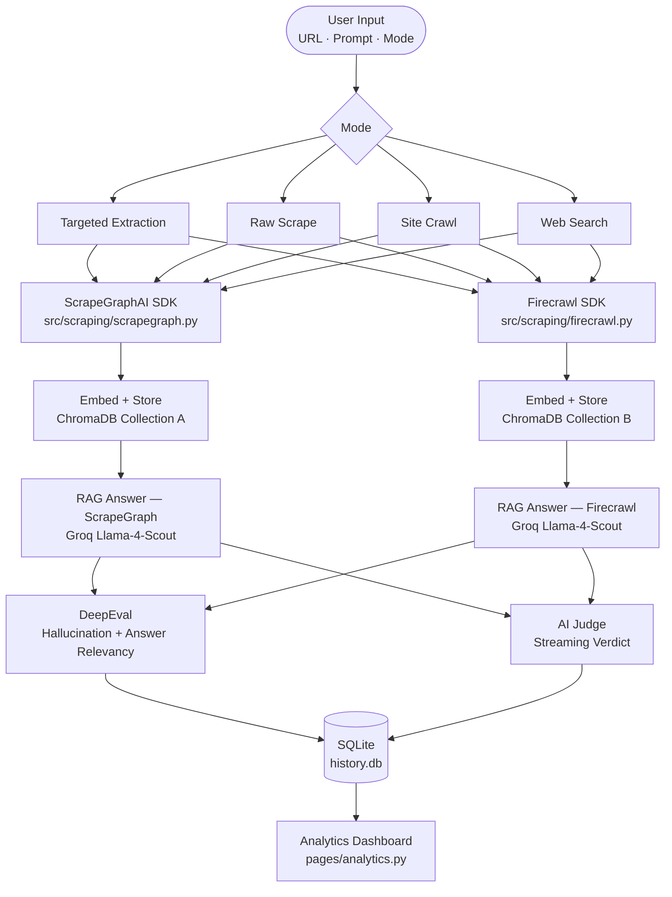
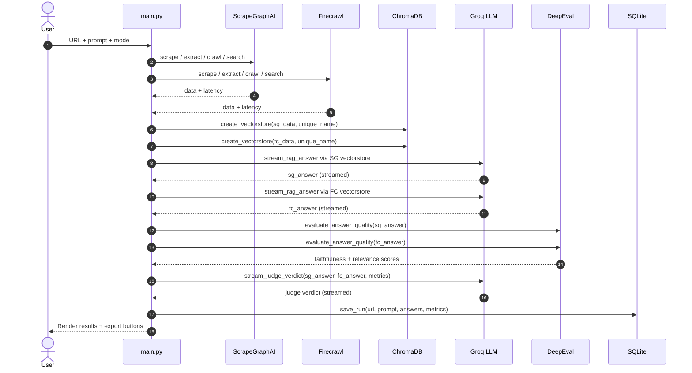

<div align="center">

# ⚡ Semantic Extraction Arena

[](https://www.python.org/)
[](https://streamlit.io/)
[](https://langchain.com/)
[](https://www.trychroma.com/)
[](https://groq.com/)
[](https://docs.confident-ai.com/)
[](LICENSE)

**A Streamlit-powered benchmarking arena that runs ScrapeGraphAI and Firecrawl side-by-side, feeds results through a RAG pipeline, evaluates quality with DeepEval, and streams an AI judge verdict.**

</div>

---

## Overview

**Semantic Extraction Arena (SEA)** compares two web-scraping APIs — **ScrapeGraphAI** and **Firecrawl** — across five operation modes. Scraped content is embedded into a **ChromaDB** vector store and queried via a **LangChain** retrieval chain backed by **Groq's Llama-4-Scout** model. Each RAG answer is scored with **DeepEval** (hallucination + answer-relevancy) and a streaming LLM judge declares the winner. All runs are saved to **SQLite** and visualised in a separate **Analytics** page.

---

## Features

| Area | What the code actually does |
|---|---|
| **5 scraping modes** | Targeted Extraction, Raw Markdown, Site Crawl, Link Discovery, Web Search |
| **Dual RAG pipeline** | One independent ChromaDB collection per provider per run (UUID-stamped) |
| **DeepEval scoring** | `HallucinationMetric` → faithfulness, `AnswerRelevancyMetric` → relevance |
| **Streaming judge** | Groq LLM streams a comparative verdict with a declared winner |
| **Run history** | SQLite `runs` table — load or delete any past run from the sidebar |
| **Analytics dashboard** | Latency charts, quality averages, win-rate cards, full runs table |
| **Export** | Download each run as JSON or Markdown report |

---

## Architecture



---

## Request Sequence



---

## Project Structure

```
comperision-scraping/
│
├── main.py                        # App entry point — pipeline, UI orchestration
├── requirements.txt               # All Python dependencies
├── .env                           # API keys (not committed)
│
├── pages/
│   └── analytics.py               # Analytics dashboard (Streamlit multi-page)
│
├── assets/
│   └── fire.svg                   # Firecrawl logo (base64-embedded in UI)
│
├── src/
│   ├── config.py                  # Env vars, model names, DB/Chroma paths
│   ├── logger.py                  # Structured logger, suppresses transformers noise
│   │
│   ├── core/
│   │   ├── pipeline.py            # execute_comparison_pipeline() — mode dispatcher
│   │   └── database.py            # SQLite CRUD (init, save, load, delete, analytics)
│   │
│   ├── scraping/
│   │   ├── scrapegraph.py         # extract, scrape, search, crawl (with async polling)
│   │   └── firecrawl.py           # scrape, extract_llm, map, search, crawl
│    │
    ├── rag/
    │   ├── vector_store.py        # ChromaDB store + HuggingFace embeddings
    │   └── qa_chain.py            # Retrieval QA chain builder & streamer
    │
│   ├── evaluation/
│   │   ├── metrics.py             # GroqDeepEvalModel wrapper, HallucinationMetric, AnswerRelevancyMetric
│   │   └── judge.py               # stream_judge_verdict() — streaming Groq LLM judge
│   │
│   ├── ui/
│   │   ├── components.py          # render_metrics, render_quality_evaluation, render_export, etc.
│   │   ├── styles.py              # Dark-mode APP_CSS (metric cards, judge card, dividers)
│   │   └── state.py               # init_session_state(), clear_current_run()
│   │
│   └── utils/
│       └── helpers.py             # calculate_metrics(), get_image_base64(), _json_depth()
│
├── chroma_db/                     # Persistent vector collections (auto-created)
└── history.db                     # SQLite run history (auto-created)
```

---

## Scraping Modes

| Mode | ScrapeGraphAI | Firecrawl |
|---|---|---|
| **Targeted Extraction** | `client.extract(prompt, url, schema?)` | `client.extract([url], prompt=prompt, schema?)` |
| **Raw Scrape** | `client.scrape(url, MarkdownFormatConfig)` | `client.scrape(url, formats=["markdown"])` |
| **Site Crawl** | `client.crawl.start()` + poll until `status != running` | `client.crawl(url, limit=5, formats=["markdown"])` |
| **Web Search** | `client.search(prompt=query)` | `client.search(query)` |

---

## Installation

**Requirements:** Python 3.10 or 3.11, and API keys for Groq, ScrapeGraphAI, and Firecrawl.

```bash
# Clone
git clone https://github.com/your-username/comperision-scraping.git
cd comperision-scraping

# Virtual environment (Windows)
python -m venv venv
.\venv\Scripts\activate

# Install dependencies
pip install -r requirements.txt
```

Create a `.env` file in the project root:

```env
GROQ_API_KEY=your_groq_api_key
SCRAPEGRAPH_API_KEY=your_scrapegraph_api_key
FIRECRAWL_API_KEY=your_firecrawl_api_key
```

---

## Running

```bash
streamlit run main.py
```

Opens at `http://localhost:8501`. The Analytics page is at `/analytics` (or the sidebar link).

**Usage:** Type a URL and your question into the chat input, for example:

```
https://example.com/pricing  What are the pricing plans?
```

For **Web Search** mode, just type a plain query — no URL needed.

---

## Configuration (`src/config.py`)

| Variable | Value |
|---|---|
| `LLM_MODEL` | `meta-llama/llama-4-scout-17b-16e-instruct` |
| `EMBED_MODEL` | `sentence-transformers/all-MiniLM-L6-v2` |
| `CHROMA_DIR` | `chroma_db/` |
| `DB_PATH` | `history.db` |

---

## Evaluation Metrics

All metrics are computed per run, per provider, and stored in SQLite.

| Metric | Source | How it is computed |
|---|---|---|
| **Faithfulness** | `DeepEval HallucinationMetric` | `1 − hallucination_score` |
| **Answer Relevance** | `DeepEval AnswerRelevancyMetric` | Direct metric score |
| **Context Relevance** | Placeholder | Stored as `0.0` — no ground truth available |
| **Scrape Latency** | `time.perf_counter()` | Time for the scraping API call |
| **RAG Latency** | `time.perf_counter()` | Time to stream the full RAG answer |
| **Total Latency** | Computed | `scrape_latency + rag_latency` |
| **Word Count** | `helpers.calculate_metrics()` | `len(str(data).split())` |
| **Field Count** | `helpers.calculate_metrics()` | `len(data)` if dict/list |
| **JSON Depth** | `helpers._json_depth()` | Recursive max nesting depth |

---

## Dependencies

| Group | Packages |
|---|---|
| **App** | `streamlit`, `python-dotenv` |
| **Scraping** | `scrapegraph-py`, `firecrawl-py` |
| **LLM / RAG** | `langchain`, `langchain-groq`, `langchain-community`, `langchain-huggingface`, `langchain-text-splitters` |
| **Vector DB** | `chromadb`, `sentence-transformers` |
| **Evaluation** | `deepeval`, `ragas`, `datasets` |

---

## Database Schema

The SQLite `runs` table stores every comparison run:

```sql
CREATE TABLE IF NOT EXISTS runs (
    id           INTEGER PRIMARY KEY AUTOINCREMENT,
    url          TEXT,
    prompt       TEXT,
    timestamp    TEXT,
    model        TEXT,
    sg_answer    TEXT,
    fc_answer    TEXT,
    judge_result TEXT,
    sg_metrics   TEXT,   -- JSON blob
    fc_metrics   TEXT,   -- JSON blob
    sg_data      TEXT,   -- JSON blob
    fc_data      TEXT,   -- JSON blob
    winner       TEXT    -- 'scrapegraph' | 'firecrawl' | NULL
)
```

---

## Contributing

1. Fork the repository
2. Create a feature branch: `git checkout -b feat/your-feature`
3. Follow the existing module conventions — all scraper functions return `(data, latency_seconds)`
4. Open a Pull Request with a clear description of what changed and why

---

## License

MIT — see [`LICENSE`](LICENSE) for details.

---

## Acknowledgements

- [ScrapeGraphAI](https://scrapegraph.ai/) — AI-powered structured web extraction
- [Firecrawl](https://www.firecrawl.dev/) — Markdown and LLM-driven scraping
- [ChromaDB](https://www.trychroma.com/) — Persistent vector similarity search
- [Groq](https://groq.com/) — Ultra-fast LLM inference
- [DeepEval](https://docs.confident-ai.com/) — LLM evaluation metrics
- [LangChain](https://langchain.com/) — RAG chain composition
